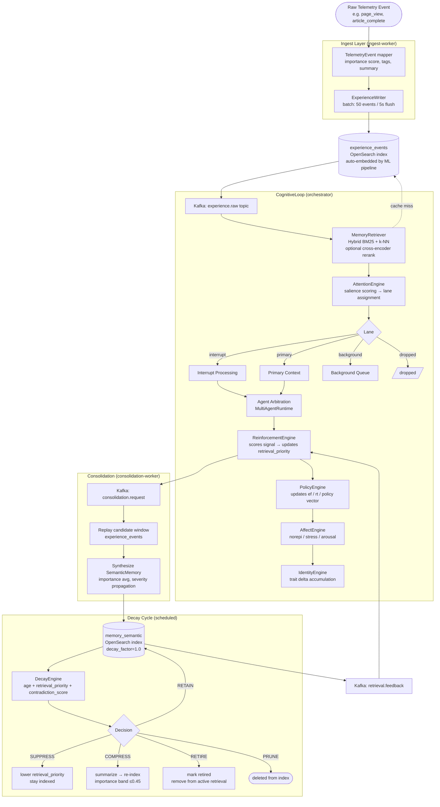

# Event / Experience Lifecycle

End-to-end flow of a telemetry event from ingestion through consolidation, reinforcement, and eventual decay/retirement.

## Stage summary

| Stage | Trigger | Output |
|---|---|---|
| Ingest → `experience_events` | telemetry event arrives | embedded document |
| `experience_events` → CognitiveLoop | Kafka `experience.raw` | live context window |
| CognitiveLoop → `memory_semantic` | consolidation request | semantic summary |
| Reinforcement → policy | agent completes turn | updated `ef`/`rt` vector |
| Decay cycle | scheduled background job | RETAIN / SUPPRESS / COMPRESS / RETIRE / PRUNE |

## Key invariants

- Re-consolidation must run every ≤5 epochs to prevent catastrophic convergence (Exp 13/16).
- `retrieval_priority` is written only by `ReinforcementEngine` — never set manually.
- `memoryIndex` in experiment config must match `SOURCE_INDEX` used during seeding.
- Contradiction-heavy signals reduce `retrieval_priority` and can drive `decay_factor` toward RETIRE.
