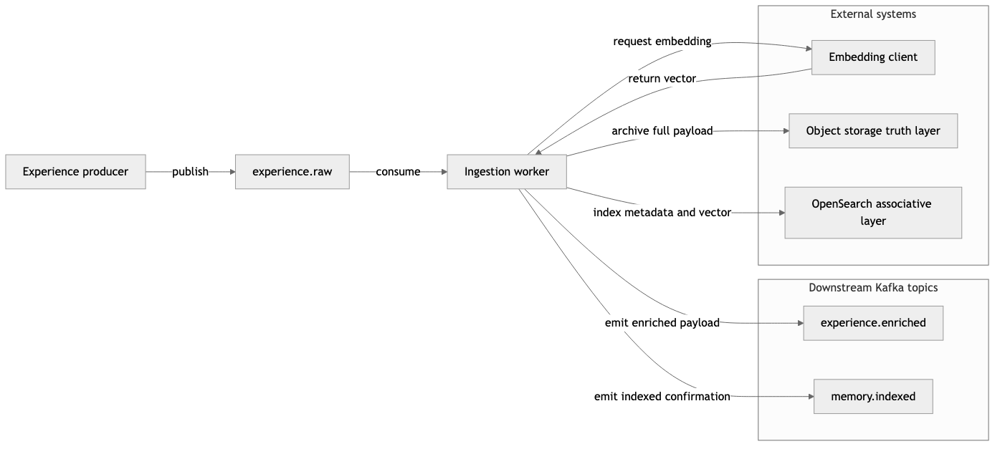

# Stage 1: Capturing Experience: The Foundation of Cognitive Memory

*Stage 1 opens the public series on Cognitive Substrate: how persistent, learnable memory differs from logging, and how ingestion turns structured experience into durable archive plus searchable index. The series targets engineers building adaptive AI systems and researchers studying persistent memory, event-driven cognition, and retrieval-oriented infrastructure.*

---

## The problem with logs

Every production AI system generates logs. Logs record what happened: requests received, responses emitted, latencies measured, errors caught. They are valuable for debugging and compliance. They are not useful for learning.

The difference between a log and an experience is structural. A log records an occurrence. An experience binds the occurrence to context, priority, action, outcome, and later retrieval paths.

The first architectural decision in building a cognitive memory system is therefore not which database to use or which embedding model to call. It is the definition of the experience event, the smallest unit from which later consolidation and policy change can operate, as developed in [Chapter 1: Cognitive Substrate Foundations](../paper/01-foundations.md) for the full stack-level narrative.

This is the main difference between Cognitive Substrate and many language-agent frameworks. CoALA-style architectures describe how an agent can organize memory, tools, learning actions, and decisions around an LLM-centered loop. This project starts one layer lower: the substrate records durable experience events before any agent decides how to use them. It is also related to Cassimatis's cognitive substrate hypothesis, which argues for integrated reusable mechanisms beneath many cognitive tasks. Here that integration is expressed as evented infrastructure, immutable archive, associative index, and later policy feedback.

## Defining the experience event

An experience event is the atomic unit of cognition in this architecture. It is a structured record that captures not merely what input arrived but the full causal context of a cognitive step:

- **Input**: the text or structured data perceived by the system.
- **Internal state**: a snapshot of working cognition at the moment of perception, including confidence level and active planning state.
- **Action**: what the system decided to do in response, including tool invocations and reasoning traces.
- **Result**: the observed outcome, including success or failure and latency.
- **Evaluation**: an initial reward score and quality assessment that seeds the reinforcement engine.

Learning requires more than a raw input. The system must preserve enough context to reconstruct why an event mattered, how it was handled, and which future retrieval paths should point back to it.

The shared schema lives in `@cognitive-substrate/core-types` as `ExperienceEvent`.

The Stage 1 runnable demo constructs a single illustration event, `rawEvent`, with the same causal fields the production worker expects: session and trace identifiers on `context`, embedding placeholder on `input`, a scored `evaluation`, and tags. A wall-clock `timestamp` feeds the same object-key layout the worker uses for immutable archive paths.

```js
const rawEvent = {
  eventId: "demo-event-001",
  timestamp: "2026-05-08T22:31:25.237Z",
  type: "user_input",
  context: { sessionId: "demo-session-001", traceId: "demo-trace-001" },
  input: {
    text: "Design a memory system that preserves complete experience while supporting fast associative retrieval.",
    embedding: [],
  },
  internalState: {
    confidence: 0.72,
    activePlan: "Compare object storage truth with OpenSearch retrieval metadata.",
  },
  action: {
    tool: "architecture_note",
    reasoning: "Capture the event before downstream learning changes its priority.",
  },
  result: { output: "Experience archived and indexed.", success: true, latencyMs: 42 },
  evaluation: { rewardScore: 0.81, selfAssessedQuality: 0.76 },
  importanceScore: 0,
  tags: ["memory", "ingestion", "demo"],
};
```

## The two-tier truth layer

Once an experience has been structured, it must be stored in a way that preserves ground truth while enabling fast associative retrieval. These two requirements pull in different directions. The architecture resolves the tension by separating them into two distinct layers.

**Object storage (truth layer):** The complete experience event, including full reasoning traces, tool outputs, and embeddings, is written to an S3-compatible object store using a deterministic key derived from the event ID and timestamp. This write is strictly once: the object is never overwritten. It serves as the immutable episodic archive for replay, audit, and later consolidation.

**OpenSearch (associative layer):** Metadata and the embedding vector are indexed in OpenSearch. Retrieval flows through this layer. It holds importance scores, decay factors, retrieval counts, tags, and pointers back to the full object-storage payload. It does not hold the full raw event.

Object storage preserves complete reconstruction; OpenSearch keeps the compact fields needed for similarity search, ranking, filtering, and lookup.

The demo performs the same split in memory, then writes two JSON artifacts: an archived payload under an `events/YYYY/MM/DD/` key path and an OpenSearch-shaped document under `experience_events`. The shapes below match `experience-ingestion-demo.mjs`.

```js
const archivedEvent = {
  ...rawEvent,
  input: { ...rawEvent.input, embedding },
  importanceScore,
  objectStorageKey,
};

const indexDocument = {
  event_id: rawEvent.eventId,
  timestamp: rawEvent.timestamp,
  event_type: rawEvent.type,
  session_id: rawEvent.context.sessionId,
  summary: rawEvent.input.text.slice(0, 240),
  embedding,
  importance_score: importanceScore,
  reward_score: rawEvent.evaluation?.rewardScore ?? 0.5,
  confidence: rawEvent.internalState?.confidence ?? 0.5,
  retrieval_count: 0,
  decay_factor: 1,
  object_storage_key: objectStorageKey,
  tags: rawEvent.tags,
};
```

## Embeddings as semantic bridges

Between raw text and the index sits the embedding step: text becomes a dense vector so semantically related experiences land near each other in vector space.

Production ingestion resolves embeddings through an `EmbeddingClient` (typically an OpenAI-compatible HTTP endpoint); tests use a zero vector stub.

The bundled demo does not call the network. It implements `stubEmbedding`, which fills a fixed eight-dimensional vector from deterministic arithmetic on the input characters so every run remains reproducible and the rest of the pipeline can be inspected offline.

## Initial importance scoring

Not all experiences deserve equal retrieval priority. At ingestion time, a heuristic importance score is computed from signals available in the raw event: event type, presence of an action block, tag density, and outcome success. This score seeds `importance_score` in the index for hybrid retrieval weighting.

The consolidation worker later refines scores using richer offline signals. Ingestion supplies only a fast prior.

The demo uses the same weighting constants as `apps/workers/ingestion/src/scorer.ts`: non-routine type weight 0.3, tags 0.2, action 0.2, success 0.3, clamped to `[0, 1]`.

```js
function scoreImportance(event) {
  const nonRoutineType = event.type !== "user_input" && event.type !== "system_event" ? 1 : 0.3;
  const hasTags = event.tags.length > 0 ? 1 : 0;
  const hasAction = event.action ? 1 : 0;
  const success = event.result?.success === true ? 1 : event.result?.success === false ? 0.1 : 0.5;
  const score = nonRoutineType * 0.3 + hasTags * 0.2 + hasAction * 0.2 + success * 0.3;
  return Math.max(0, Math.min(1, Number(score.toFixed(3))));
}
```

## The asynchronous pipeline

The ingestion worker is not a synchronous request handler. It consumes `experience.raw`, enriches each event, writes archive and index, and publishes downstream topics. That pattern isolates producers from embedding latency and storage failures.

The figure summarizes producers, topics, the ingestion worker, embedding client, object storage, OpenSearch, and the two completion topics.



After each event, the worker emits:

- **`experience.enriched`**: event ID, timestamp, importance score, embedding dimension, object-storage key, and tags for consumers that extend enrichment.
- **`memory.indexed`**: confirmation that the memory row exists, including index name and pointer back to the archive.

When trace context is present on the raw event, production publishers attach W3C `traceparent` on downstream Kafka records where configured.

The demo writes the same logical payloads to JSON files named after those topics. They omit full archive bodies on purpose.

```js
const enrichedPayload = {
  eventId: rawEvent.eventId,
  timestamp: rawEvent.timestamp,
  importanceScore,
  embeddingDimension: embedding.length,
  objectStorageKey,
  tags: rawEvent.tags,
};

const indexedPayload = {
  eventId: rawEvent.eventId,
  timestamp: rawEvent.timestamp,
  index: "experience_events",
  objectStorageKey,
};
```

## What the ingestion stage does not do

The ingestion pipeline does not learn. It does not update policy weights, adjust retrieval rankings from historical outcomes, or form abstract clusters. Consolidation (Stage 3) and reinforcement (Stage 9) own those concerns. Ingestion only makes experiences durable and discoverable with minimal latency and maximal fidelity.

Keeping capture separate from learning keeps feedback paths legible and components replaceable.

## Observability in production versus the demo

In deployment, each ingestion step emits OpenTelemetry spans under the `cog.*` conventions from `@cognitive-substrate/telemetry-otel`. The root span `experience.ingest` carries event identity; children cover embedding, object write, and index write, exportable to Tempo or any OTLP backend.

The Stage 1 demo does not export OTLP. Instead it emits `ingestion-trace.json`, a ordered list of stages with the same conceptual boundaries (receive, embed, score, key derivation, split archive versus index, emit notifications). `summary.json` lists the verified invariants the script asserts before exit.

## Running the Stage 1 demo

The companion script is a single Node file with no third-party dependencies. It clears and repopulates `runnable/out/` on each run so inspection stays repeatable.

```bash
node docs/articles/companions/article-01-experience-ingestion/runnable/experience-ingestion-demo.mjs
```

Each run materializes:

- **Truth layer sample:** full archived JSON under an `object-store/events/...` path matching the derived key.
- **Index sample:** retrieval document beside `experience_events`, including embedding vector and pointer fields.
- **Topic payloads:** JSON files standing in for `experience.enriched` and `memory.indexed`.
- **Trace and summary:** human-readable stage narration plus a short list of checked invariants (archive retains reasoning, index points at archive, downstream payloads stay compact).

Together these artifacts exercise the same ordering as production: structured event in, embedding attached, heuristic score, deterministic key, archive versus index split, compact downstream notifications. Substitutions are explicit: local files instead of S3, OpenSearch, or Kafka; deterministic embedding instead of a remote model; trace JSON instead of exported spans.

## What comes next

Stage 2 introduces [memory retrieval](article-02-memory-retrieval.md): hybrid BM25 and k-NN with policy-weighted ranking. That is where Stage 1 indexing becomes active cognition shaped by stored experience rather than text alone.
