# Operational Signal Pipeline

End-to-end flow from raw operational signals through consolidation into retrievable semantic memories, as validated by experiments 15–18.

## Sequence Diagram

```mermaid
sequenceDiagram
    autonumber

    participant G as OperationalDataGenerator
    participant EE as experience_events<br/>(OpenSearch)
    participant CE as ConsolidationEngine
    participant ECM as ExtractiveConsolidationModel
    participant MS as memory_semantic<br/>(OpenSearch)
    participant BM as BM25 Retrieval

    rect rgb(30, 50, 80)
        Note over G,EE: Indexing Phase — 200 signals across 4 incident windows
        G->>G: emit OperationalSignal<br/>(eventId, timestamp, type,<br/>importanceScore, tags, payload)
        Note right of G: payload.severity → importanceScore<br/>normal≈0.26 · degraded≈0.68<br/>outage≈0.92 · recovery≈0.26
        G->>EE: index doc<br/>{event_id, summary, importance_score,<br/>reward_score=0, retrieval_count=0,<br/>decay_factor=1.0, tags}
        Note right of EE: summary = narrative built from<br/>window + service + severity text<br/>e.g. "outage on auth-service<br/>severity 0.92"
        Note over G,EE: Repeat ×200: 40 normal · 60 degraded · 50 outage · 50 recovery
    end

    rect rgb(30, 60, 50)
        Note over CE,MS: Consolidation Phase — once per incident window
        CE->>EE: selectReplayCandidates()<br/>bool filter: requiredTags=[window, tag]<br/>+ decay-aware replay query
        EE-->>CE: candidate ExperienceEvents<br/>(filtered, ranked by importance)
        Note right of CE: requiredTags prevents<br/>cross-window contamination —<br/>source counts match exactly<br/>40/60/50/50
        CE->>ECM: generate(candidates)
        Note right of ECM: top-3 by importanceScore selected
        ECM->>ECM: concatenate top-3 summaries → summary
        ECM->>ECM: extract dominant tags → generalization sentence
        ECM->>ECM: average embeddings<br/>(empty [] when sources carry none)
        ECM-->>CE: ConsolidationDraft<br/>{summary, generalization, embedding}
        CE->>CE: importance_score = avg(candidate.importanceScore)<br/>stability_score = avg((importance + reward) / 2)
        Note right of CE: outage: importance=0.92 stability=0.71<br/>degraded: importance=0.68 stability=0.59<br/>normal/recovery: importance≈0.26 stability≈0.38
        CE->>MS: write SemanticMemory<br/>{memory_id, summary, generalization,<br/>importance_score, stability_score,<br/>source_event_ids, decay_factor=1.0}<br/>⚠ embedding field omitted when empty
        Note right of MS: knn_vector rejects [] —<br/>field is conditionally excluded
    end

    rect rgb(60, 30, 50)
        Note over BM,MS: Retrieval Phase — BM25 keyword search
        BM->>MS: search(query, filter: memory_id IN [4 known ids])
        Note right of BM: e.g. "outage critical incident latency"<br/>→ BM25 scores against summary + generalization
        MS-->>BM: ranked SemanticMemory list
        BM-->>BM: top-1 per query window verified:<br/>· "outage critical…" → outage memory (0.92)<br/>· "degraded performance threshold" → degraded (0.68)<br/>· "normal steady state" → normal (0.26)<br/>· "recovery restored services" → recovery (0.26)
    end
```

## Key Design Decisions

**Severity → importanceScore** happens at indexing time in the generator, not during consolidation — the engine averages what is already scored.

**Empty embedding guard** — the `knn_vector` field is conditionally omitted rather than defaulted to `[]`, since OpenSearch rejects empty arrays for vector fields.

**`requiredTags` as contamination barrier** — the bool filter on `selectReplayCandidates()` is what produces the exact 40/60/50/50 source counts. Without it, cross-window signals bleed into consolidated memories.

**stabilityScore formula** — `(importance + reward) / 2` per candidate, then averaged across candidates. Because `reward_score` starts at 0 for fresh signals, high-severity outage signals drive stability primarily through their importance alone (outage: 0.71).

## Validated Outcomes (Experiment 18)

| Window   | importanceScore | stabilityScore | sourceCount |
|----------|-----------------|----------------|-------------|
| outage   | 0.92            | 0.71           | 50          |
| degraded | 0.68            | 0.59           | 60          |
| recovery | ≈0.26           | ≈0.38          | 50          |
| normal   | ≈0.26           | ≈0.38          | 40          |

BM25 top-1 retrieval correct for all 4 incident windows with no cross-window contamination.
