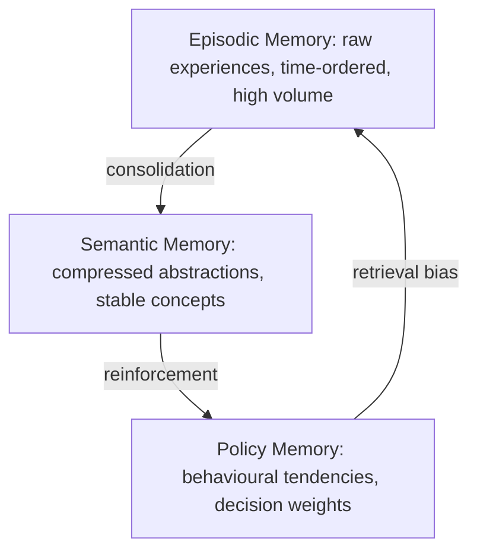

# Chapter 01. Cognitive Substrate Foundations

*Chapter 01. Companion code: Stage 1 (experience ingestion), Stage 5 (cognitive agent loop).*

---

## 1.1 The Inadequacy of Static Computation

Most artificial intelligence systems in contemporary use are tools in the strict engineering sense: they transform input into output and remain structurally unchanged by that transformation. Even systems built on large language models, despite their generative fluency, operate as stateless functions between sessions. Memory, when present, is attached externally and does not alter the model itself.

A Cognitive Substrate architecture is defined differently. It is not a function. It is a process that continuously updates its own structure as a consequence of experience. This distinction is the boundary between static computation and adaptive intelligence.

To understand this distinction precisely, two meanings of computation must be separated. In conventional systems, computation is the transformation of input into output. In adaptive systems, computation includes the transformation of the system itself. The second form of computation is what biological intelligence performs continuously and, until recently, what engineered systems have not.

This framing is adjacent to, but distinct from, two important lines of work. CoALA-style language-agent architectures describe how language models can be placed inside agent loops with working memory, retrieval, learning actions, and external tools. Cognitive Substrate shifts the emphasis from the loop inside one agent to the durable substrate beneath many agents: event streams, memory indexes, policy state, trace evidence, and bounded updates. Cassimatis's cognitive substrate hypothesis and Polyscheme architecture argue for a small integrated set of mechanisms that can support broad cognition. Cognitive Substrate follows that integration impulse, but implements it as distributed infrastructure for persistent experience rather than as a single-agent focus-of-attention architecture.

## 1.2 Experience as the Atomic Unit of Change

In a self-modifying system, the smallest meaningful unit is not a token, a message, or a request-response pair. It is an experience event.

An experience event captures the full causal context of a cognitive step:

- the input perceived from the environment
- the internal state at the moment of perception
- the action selected in response
- the outcome observed after the action
- an evaluation of whether the action advanced any active goal

This structure mirrors biological cognition at a computational level. In biological systems, experiences are encoded as relational patterns rather than isolated facts. The critical insight is that intelligence does not learn from data in isolation. It learns from the consequences of actions within context. A consequence-free data stream produces no adaptive signal.

This imposes a fundamental requirement on any system that claims to adapt: every experience must carry a signal indicating whether the system's behaviour should be reinforced or weakened. Without this signal, no stable adaptation is possible. Retrieval without evaluation produces a log, not a memory.

## 1.3 Memory as Selection, Not Storage

A persistent misconception in engineered memory systems is that memory is fundamentally a storage problem. The correct framing is that memory is a selection problem.

Biological systems do not attempt to retain every stimulus with equal fidelity. They apply continuous selection pressure to determine what is worth retaining, with that pressure governed by multiple factors including emotional significance, repetition frequency, prediction utility, novelty, and survival relevance.

This shifts the design requirement fundamentally. Memory in an adaptive cognitive architecture is not a passive accumulator. It is an active filtering and transformation system. The implication is that memory is continuously rewritten, compressed, and reorganised rather than appended.

## 1.4 The Three-Layer Cognitive Stack

A practical adaptive substrate can be structured into three memory layers with distinct responsibilities, as illustrated below:

**Episodic memory** stores raw experiences. It is high-volume, low-abstraction, and time-ordered. In the implementation described in subsequent parts, this layer is realised as an object-storage truth archive: write-once, never overwritten, serving as the ground-truth record of every event the system has processed.

**Semantic memory** stores compressed knowledge derived from episodic memory through a consolidation process. It contains abstractions, generalised patterns, and stable concepts. In the implementation, this layer is realised as an OpenSearch index holding embedding vectors and importance-scored summaries.

**Policy memory** controls behaviour. It determines how the system acts in novel situations based on accumulated outcomes. It is the most sensitive layer because it directly influences future decisions. In biological systems, this layer corresponds to learned behavioural tendencies shaped through reinforcement.

## 1.5 Consolidation as the Locus of Intelligence

Without consolidation, memory becomes noise. With consolidation, memory becomes intelligence.

Consolidation is the process that transforms episodic memory into semantic and policy memory. It involves:

1. Replay of past experience events
2. Evaluation of outcomes in light of accumulated context
3. Compression of specific episodes into abstract patterns
4. Reinforcement or decay of behavioural tendencies

This process is analogous to offline replay in biological cognition, in which the brain reactivates experience traces during low-arousal states and integrates them into long-term memory systems. The critical observation is that intelligence emerges not during experience acquisition but during the consolidation of experience. The ingestion pipeline described in Stage 1 acquires raw experience. The consolidation worker described in Stage 3 is where learning occurs.

## 1.6 Why Self-Modification is Necessary

Static systems fail in dynamic environments because they cannot update their internal structure. They may accumulate data, but they cannot change how they reason about that data.

A self-modifying system changes three things over time: what it remembers, how it interprets memory, and how it acts based on memory. This produces the feedback loop targeted by adaptive cognitive infrastructure:

1. The system acts.
2. The system observes the outcome.
3. The system updates memory.
4. The system updates policy.
5. The system acts differently in analogous future situations.

Without steps 3 and 4, there is no adaptation, only repetition. The remainder of this paper describes an implementable engineering path for each step while treating production readiness and longitudinal improvement as evaluation targets.

## 1.7 Policy Drift and Identity Formation

Policy drift is the gradual change in decision-making behaviour over time, driven by accumulated reinforcement signals. It is not random perturbation. When a strategy succeeds repeatedly, it becomes more likely to be selected in the future. When a strategy fails, it decays. Over time, these updates accumulate into stable behavioural continuity, a phenomenon this paper refers to as identity formation. Chapter 03 develops the drift mechanism, update equation, and identity attractor model in full.

The danger of unconstrained policy drift is instability: runaway reinforcement of initially successful but ultimately brittle strategies, collapse into narrow behavioural loops, or amplification of memory biases. The constitutional stability layer described in Chapter 17 addresses these failure modes systematically.

## 1.8 The Minimum Viable Architecture

The minimum viable architecture for Cognitive Substrate consists of seven components:

1. Experience ingestion layer
2. Episodic memory store (object storage)
3. Associative retrieval system (OpenSearch with hybrid query)
4. Reasoning engine (large language model)
5. Action interface (tools, APIs, external systems)
6. Consolidation engine (offline replay, clustering, abstraction)
7. Policy update engine (reinforcement, identity drift)

Stage 1 of this implementation addresses the first two components with the strongest runtime evidence. Subsequent stages add buildable packages, workers, and design surfaces for the remaining components, building toward a continuously operating cognitive loop whose behavior still requires deeper longitudinal evaluation.

## 1.9 Transition

Chapter 02 addresses the memory substrate: the three-tier architecture, OpenSearch schema design, object-storage layout, and the hybrid retrieval strategy that approximates associative recall. The next part formalises how memory becomes a learning signal rather than a storage system.
